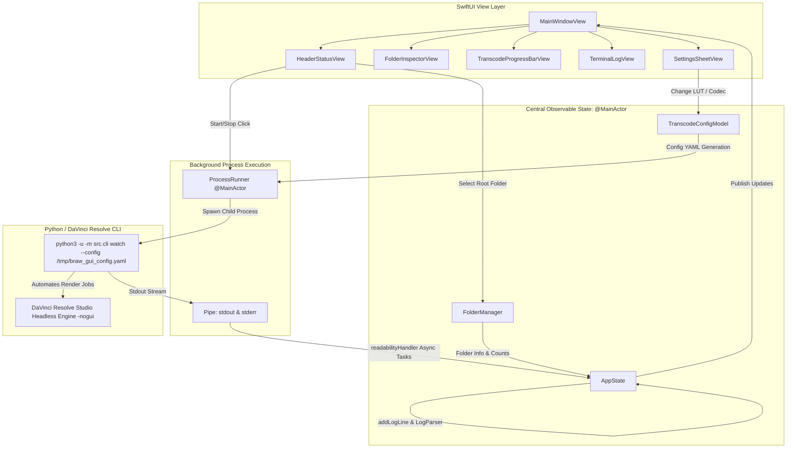

# BRAW Video Converter — Version 2 (GUI) Architectural Changelog & Developer Specification

## 1. Overview & System Mission

**Version 2 (`versions/v2-gui/`)** extends the Version 1 DaVinci Resolve automated transcoding backend by providing a **native macOS SwiftUI desktop application (`BRAWConverterGUI`)**.

Instead of interacting through terminal CLI commands (`./scripts/start_watcher.sh`), users have an interactive desktop control interface with:
1. **Dynamic Root Watch Folder Management & Safe Auto-Provisioning**: Support for arbitrary folder names on internal or external SSD drives with automatic creation of the 5 required subdirectories without altering existing files.
2. **Interactive Watcher Controls & State Machine**: One-click Start / Stop button with live visual service states.
3. **Live Engine Terminal & Ingest Log Stream**: High-performance dark-mode console displaying real-time formatted engine output with ANSI color parsing and autoscroll.
4. **Live Transcode Progress Meter**: Real-time progress bar, active clip name display, and throughput rate (`fps`).
5. **Visual 5-Stage Pipeline Inspector**: Real-time file count counters with direct "Reveal in Finder" capabilities.
6. **Dynamic LUT & Codec Configuration**: Real-time selection of Blackmagic 3D LUTs and H.265 profiles, generating runtime YAML configs for the background process.

---

## 2. Directory Layout & Module Structure

```text
versions/v2-gui/
├── Package.swift                                      # Swift Package Manager manifest (macOS 13+)
├── scripts/
│   └── start_gui.sh                                  # Release build launcher script
├── Sources/
│   └── BRAWConverterGUI/
│       ├── App.swift                                 # Application entry point (@main Scene)
│       ├── Models/
│       │   ├── FolderManager.swift                   # Root resolution, safe provisioning, file counting
│       │   ├── TranscodeConfigModel.swift            # LUT definitions, codec profiles, YAML generator
│       │   └── AppState.swift                        # @MainActor central state, log parser, event loop
│       ├── Services/
│       │   └── ProcessRunner.swift                   # Subprocess manager, async pipe reader, signal handling
│       └── Views/
│           ├── MainWindowView.swift                  # Master view layout container & sheet presenter
│           ├── HeaderStatusView.swift                # App title, Start/Stop toggle, folder selector
│           ├── FolderInspectorView.swift             # 5 pipeline cards with live badge counts
│           ├── TranscodeProgressBarView.swift        # Progress bar, fps meter, and clip label
│           ├── TerminalLogView.swift                 # Dark-mode live console with autoscroll & copy
│           └── SettingsSheetView.swift               # LUT & video/audio configuration modal
└── Tests/
    └── BRAWConverterGUITests/
        └── FolderManagerTests.swift                  # XCTest suite for folder integrity & safety
```

---

## 3. Detailed Component Architecture & Data Flow



---

## 4. Systematic Deep Dive into Inner Workings

### 4.1 Folder Manager & Safe Provisioning (`FolderManager.swift`)
* **Core Rule**: The root folder can be named **anything** (e.g. `/Volumes/T7_Shield/ProjectMedia`, `/Volumes/Card1/2026-08-27_A_CAM`, or `watch_folders`).
* **Immutable Subdirectory Names**: The 5 subdirectories inside the root folder **must never change**:
  1. `00_IN_INGEST` — Drop target for camera files.
  2. `01_PROCESSING` — Temporary workspace for in-flight files.
  3. `02_COMPLETED_MP4` — Output destination for 1:1 H.265 MP4 files.
  4. `03_ARCHIVE_BRAW` — Archive for source BRAW clips after successful render.
  5. `99_FAILED` — Quarantine for corrupt or un-renderable clips.
* **Safe Auto-Provisioning Logic (`validateAndProvision`)**:
  - Checks if each directory exists via `FileManager.default.fileExists(atPath:)`.
  - Creates **only missing directories** (`withIntermediateDirectories: true`).
  - **Never touches, moves, or deletes existing files or archives** in `03_ARCHIVE_BRAW` or `02_COMPLETED_MP4`.
* **State Persistence**: Persists the selected root URL string into `UserDefaults.standard` under key `"braw_root_watch_folder_path"`.

### 4.2 Central Application State & Regex Log Parsing (`AppState.swift`)
* **MainActor Isolation**: Decorated with `@MainActor` for thread-safe UI updates in Swift 6 concurrency.
* **Periodic Polling Timer**: Emits every 2.0 seconds on `.main` to update file counts across the 5 subfolders.
* **Log Stream Parser (`parseLogLine`)**:
  - Automatically identifies in-flight job starts: `Starting transcode job for: <clip_name>` $\to$ transitions `serviceState` to `.transcoding` and updates `currentClipName`.
  - Regex progress extractor: `Transcode Progress:\s*(\d+)%` $\to$ updates `transcodeProgress` (0.0 to 1.0) on the UI progress bar.
  - Regex throughput extractor: `Speed:\s*([\d\.]+)\s*fps` $\to$ updates `transcodeFps`.
  - Completion detection: `Render completed successfully` $\to$ sets progress to 100%, transitions back to `.watching` after 2s, and triggers an immediate subfolder file count refresh.
  - Failure detection: `Transcode failed` $\to$ updates status message and refreshes folder counters.

### 4.3 Subprocess Lifecycle & Pipe Management (`ProcessRunner.swift`)
* **Configuration Generation**: On start, invokes `appState.config.generateYAML(forRootFolder:)` and writes an ephemeral configuration file to `NSTemporaryDirectory()/braw_gui_config.yaml`.
* **Environment Injection**:
  - `RESOLVE_SCRIPT_API="/Library/Application Support/Blackmagic Design/DaVinci Resolve/Developer/Scripting"`
  - `RESOLVE_SCRIPT_LIB="/Applications/DaVinci Resolve/DaVinci Resolve.app/Contents/Libraries/Fusion/fusionscript.so"`
  - `PYTHONPATH="$PYTHONPATH:$RESOLVE_SCRIPT_API/Modules/:$PROJECT_DIR"`
* **Unbuffered Execution**: Invokes `python3 -u -m src.cli watch --config <temp_config>` with the `-u` flag so Python does not buffer `stdout`, providing immediate millisecond log feedback.
* **Asynchronous Streaming**: Attaches `readabilityHandler` callbacks to `stdoutPipe` and `stderrPipe`, wrapping incoming string chunks in `@MainActor Task` blocks to append to `appState.logs`.
* **Graceful Termination**:
  - First issues a `proc.interrupt()` (`SIGINT`) to allow the Python watcher and Resolve engine to execute their graceful cleanup handlers (`resolve.Quit()`).
  - Implements a fallback timeout (3.0s) before sending `proc.terminate()` (`SIGTERM`) if the process remains alive.

### 4.4 UI View Hierarchy & Aesthetics
* **Theme**: Deep dark-mode aesthetic with macOS control styles, subtle borders, and harmonious badge tints.
* **`HeaderStatusView`**:
  - Displays application branding, version badge (`v2.0 (GUI)`), custom root path, and large Start/Stop button.
  - "Change Root..." triggers an `NSOpenPanel` restricted to directory selection (`canChooseFiles = false`).
* **`FolderInspectorView`**:
  - Horizontal scrolling row of 5 stylized cards with SF Symbols icons and badge counters.
  - Each card provides a direct "Reveal in Finder" button using `NSWorkspace.shared.selectFile`.
* **`TranscodeProgressBarView`**:
  - Animates in when `serviceState == .transcoding`.
  - Displays clip name, encoding speed (`fps`), percentage (`XX%`), and progress bar.
* **`TerminalLogView`**:
  - Terminal-like header with window control dots, autoscroll toggle, "Copy All" button, and "Clear" button.
  - Colored log lines: Red for `[ERROR]`, Yellow for `[WARNING]`, Blue for `[GUI]`, Green for progress/completion, Cyan for file detection/stabilization.

---

## 5. Critical Invariants for Future Agents & Developers

> [!IMPORTANT]
> **DO NOT** modify the following core behaviors without understanding their architectural implications:

1. **Keep Subfolder Names Exact**:
   The Python backend (`src/common/watcher.py`) and Swift GUI (`FolderManager.swift`) rely on exact matching strings: `00_IN_INGEST`, `01_PROCESSING`, `02_COMPLETED_MP4`, `03_ARCHIVE_BRAW`, and `99_FAILED`. Never change or localize these names.
2. **Always Use Unbuffered Python (`-u`)**:
   In `ProcessRunner.swift`, the `-u` flag in `["-u", "-m", "src.cli", ...]` is required. Without it, Python buffers `stdout` in block mode and the GUI log console will appear frozen until a transcode finishes.
3. **Preserve MainActor Concurrency Bounds**:
   `AppState`, `ProcessRunner`, and SwiftUI views must remain on `@MainActor`. All background pipe reads in `readabilityHandler` must dispatch to `Task { @MainActor in ... }`.
4. **Preserve Graceful Shutdown Sequence**:
   Do not force-kill (`kill -9`) the backend process directly. The Python client must receive `SIGINT` to call `resolve.Quit()`, preventing macOS Fairlight `SIGABRT` crashes.

---

## 6. Verification & Automated Test Commands

### Running Swift Unit Tests
```bash
cd versions/v2-gui
swift test
```
**Tests Passed:**
* `testCustomRootNameFlexibility`
* `testValidateAndProvisionCreatesAllRequiredSubfolders`
* `testValidateAndProvisionPreservesExistingFiles`

### Building Production Release Binary
```bash
cd versions/v2-gui
swift build -c release
```

### Launching the Application
```bash
./scripts/start_gui.sh
```
