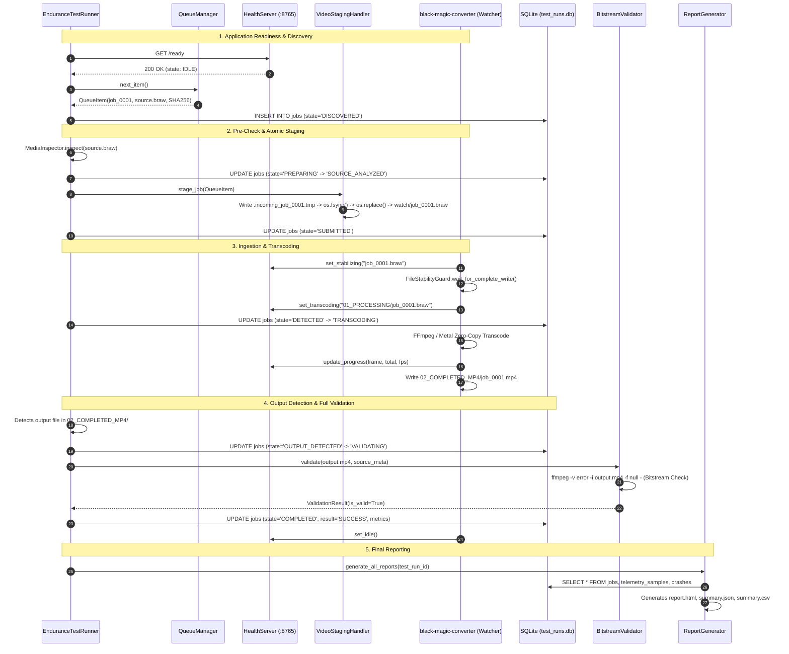
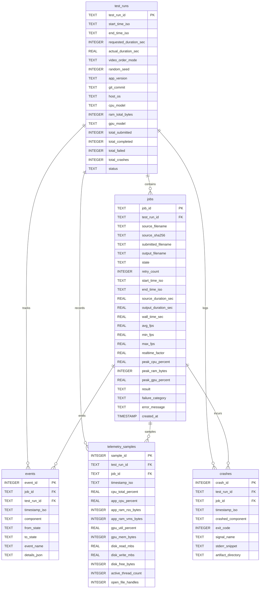
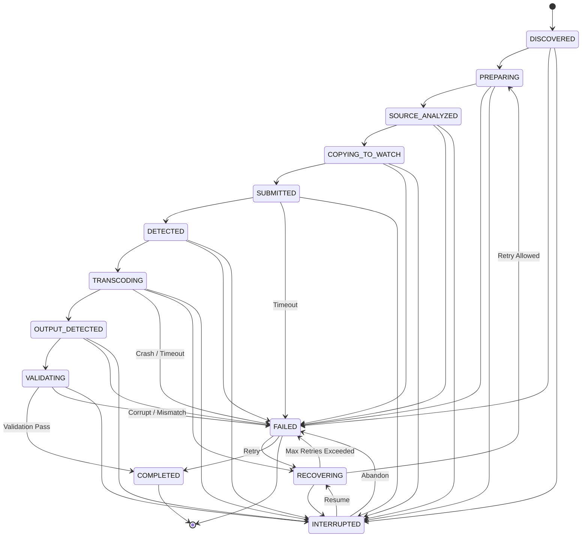

# Black Magic Converter — Debugging, Observability & Endurance Testing Schematics

This document provides a comprehensive architectural schematic of the entire `debug_tools/` toolkit, detailing each subsystem, inter-process communication contracts, data flows, database schemas, state machines, and wiring between components.

---

## 1. High-Level Process Architecture & Topology

The debugging toolkit operates under a strict **Process Isolation Model**: the supervisor watchdog, telemetry collectors, test harness, and reporting pipelines run in independent processes decoupled from the video transcoding application (`black-magic-converter`).

```mermaid
graph TD
    subgraph HostOS [Host Operating System / Supervisor Layer]
        CLI[run_endurance.py] -->|Initializes| WD[WatchdogSupervisor<br/>debug_tools/supervisor/watchdog.py]
        CLI -->|Initializes| DB[(SQLite 3 WAL<br/>database/test_runs.db)]
        CLI -->|Initializes| LOG[MultiStreamLogger<br/>logs/*.log]
        WD -->|Spawns Subprocess| APP[Transcoding Application<br/>src.cli watch]
        CLI -->|Runs In-Process| HARNESS[EnduranceTestRunner<br/>debug_tools/harness/test_runner.py]
    end

    subgraph AppProcess [Transcoding App Engine (PID: X)]
        APP --> HEALTH[Health Server :8765<br/>debug_tools/core/health_server.py]
        APP --> WATCH[FolderWatcher<br/>src/common/watcher.py]
        APP --> PIPE[FFmpegPipeline / Metal<br/>src/ffmpeg_engine/]
    end

    subgraph HarnessSubsystems [Test Harness Subsystems]
        HARNESS --> QM[QueueManager<br/>debug_tools/harness/queue_manager.py]
        HARNESS --> STAGE[VideoStagingHandler<br/>debug_tools/harness/staging.py]
        HARNESS --> SM[JobStateMachine<br/>debug_tools/core/state_machine.py]
        HARNESS --> TEL[TelemetryCollector<br/>debug_tools/telemetry/collector.py]
        HARNESS --> INSP[MediaInspector<br/>debug_tools/validation/media_inspector.py]
        HARNESS --> VAL[BitstreamValidator<br/>debug_tools/validation/bitstream_validator.py]
        HARNESS --> PKG[ArtifactPackager<br/>debug_tools/supervisor/artifact_packager.py]
    end

    subgraph DataOutputs [Persistent Data & Reporting Outputs]
        DB --> REP[ReportGenerator<br/>debug_tools/reporting/report_generator.py]
        REP --> HTML[reports/test_run_report.html]
        REP --> JSON[reports/test_run_summary.json]
        REP --> CSV[reports/test_run_summary.csv]
        PKG --> FAIL[failures/job_id/*]
    end

    %% Probes and Signals
    WD -.->|GET /health polling| HEALTH
    STAGE -.->|GET /ready check| HEALTH
    TEL -.->|psutil PID sampling| APP
    WATCH -.->|Updates state & progress| HEALTH
    PIPE -.->|Updates frame progress| HEALTH
```

---

## 2. Component Directory & File Map

| Module Path | Primary Class / Entry Point | Responsibility & Wire Connections |
| :--- | :--- | :--- |
| `debug_tools/run_endurance.py` | `main()` | Single-command CLI orchestrator. Parses YAML config & flags, boots DB, logs, Watchdog, Test Runner, and triggers final report generation. |
| `debug_tools/config/endurance_config.yaml` | YAML Schema | Configuration for timeouts, thresholds, directories, video sequencing modes, and fault injection. |
| `debug_tools/core/database.py` | `DatabaseManager` | Thread-safe SQLite3 engine with `PRAGMA journal_mode = WAL`. Manages tables `test_runs`, `jobs`, `events`, `telemetry_samples`, `crashes`. |
| `debug_tools/core/logger.py` | `MultiStreamLogger`, `GzipRotatingFileHandler` | NDJSON structured logger with 7 rotating streams and `.gz` backups. |
| `debug_tools/core/health_server.py` | `HealthServer`, `AppStateHolder` | In-process daemon HTTP server running on `127.0.0.1:8765` providing `/health`, `/status`, `/ready`, `/shutdown`. |
| `debug_tools/core/state_machine.py` | `JobStateMachine`, `JobState` | Enforces the 13-state transition matrix and persists all state transitions to SQLite `events` and NDJSON logs. |
| `debug_tools/harness/queue_manager.py` | `QueueManager`, `QueueItem` | Discovers test media clips, calculates chunked SHA-256 digests, and delivers deterministic queues (`seeded_random`, `sequential`, `alphabetical`, `random`, `loop`). |
| `debug_tools/harness/staging.py` | `VideoStagingHandler` | 3-step atomic ingestion handler (`.tmp` write -> `os.fsync` -> `os.replace`) with `/ready` health synchronization. |
| `debug_tools/harness/test_runner.py` | `EnduranceTestRunner` | Main loop orchestrating job submissions, timeouts (`startup`, `max_job`, `hang`), detection, and validation. |
| `debug_tools/validation/media_inspector.py` | `MediaInspector`, `MediaMetadata` | Wraps `ffprobe` JSON CLI to parse video/audio codecs, framerates, durations, color primaries, and pixel formats. |
| `debug_tools/validation/bitstream_validator.py` | `BitstreamValidator`, `FailureCategory` | Runs full null-mux decode pass (`ffmpeg -v error -i <file> -f null -`), compares duration/FPS tolerances, and classifies errors into 18 standardized failure enums. |
| `debug_tools/telemetry/collector.py` | `TelemetryCollector` | Background thread sampling CPU %, App RAM RSS/VMS, GPU % (NVIDIA/discrete; unified memory returns NULL on Apple Silicon), Disk I/O MB/s, free space, thread counts, and open FDs every 1–5s. |
| `debug_tools/telemetry/leak_analyzer.py` | `LeakAnalyzer` | Linear regression slope calculator for RAM growth (MB/hr), thread leaks, FD leaks, and moving-average FPS decay. |
| `debug_tools/supervisor/watchdog.py` | `WatchdogSupervisor` | Parent process manager executing exponential restart backoff (`0s`, `2s`, `5s`, `15s`, `30s`), crash loop breaker (max 5), and signal handling. |
| `debug_tools/supervisor/heartbeat.py` | `HeartbeatMonitor` | Polling daemon probing `127.0.0.1:8765/health` and detecting application hang conditions. |
| `debug_tools/supervisor/artifact_packager.py` | `ArtifactPackager` | Bundles isolated forensic folders under `failures/<job_id>/` with metadata, ffprobe outputs, logs, telemetry, and crash dumps. |
| `debug_tools/reporting/report_generator.py` | `ReportGenerator` | Builds standalone single-file `report.html` (with dark theme, KPI cards, SVG sparklines, and filterable tables), `summary.json`, and `summary.csv`. |
| `debug_tools/chaos/fault_injector.py` | `FaultInjector` | Simulates real-world fault conditions: process kills (`SIGKILL`), media byte corruption, and artificial latency delays. |

---

## 3. Detailed Data Flow & Lifecycle of a Single Transcode Job



---

## 4. SQLite Schema & Entity-Relationship Model

All test data is stored transactionally in `database/test_runs.db` with **WAL mode** (`PRAGMA journal_mode = WAL;`) and enforced foreign keys:



---

## 5. Formal Job State Machine Transition Graph

Every job transitions through strict, validated states in `debug_tools/core/state_machine.py`. Attempted transitions outside this matrix raise `InvalidStateTransitionError`:



---

## 6. Multi-Stream Structured NDJSON Logging Schematics

Logs are written into `logs/` split into 7 discrete streams with schema conformance:

```json
{
  "timestamp_iso": "2026-09-01T18:45:00.123456Z",
  "timestamp_mono_ns": 1423859238491,
  "test_run_id": "tr_20260901_184500_abc123",
  "job_id": "job_0001_A001_C001",
  "component": "harness|application|watchdog|transcoder",
  "event": "transcode_started",
  "level": "INFO",
  "pid": 54321,
  "thread_id": 12314534,
  "data": {
    "source_file": "...",
    "output_file": "...",
    "frame_count": 4500,
    "fps": 59.94
  }
}
```

### Log Stream Matrix:
1. `logs/application.log`: Application lifecycle, engine initialization, watch folder scanning.
2. `logs/errors.log`: Filtered stream of all WARNING, ERROR, and CRITICAL events across all components.
3. `logs/transcodes.log`: Start, frame progress, and transcode completions.
4. `logs/performance.log`: Raw periodic telemetry time-series samples.
5. `logs/harness.log`: Video queueing, atomic staging, validation, and runner events.
6. `logs/watchdog.log`: Supervision, subprocess spawns, heartbeats, and restart backoffs.
7. `logs/results.jsonl`: Terminal completion summary records per job.

---

## 7. Failure Classification Taxonomy & Artifact Bundling

When a job fails or crashes, it is categorized into one of 18 strict enums in `debug_tools/validation/bitstream_validator.py`:

```
1.  APP_CRASH                   10. OUTPUT_CORRUPT
2.  HARNESS_CRASH               11. OUTPUT_VALIDATION_FAILURE
3.  TRANSCODER_CRASH            12. FFMPEG_FAILURE
4.  WATCHDOG_FAILURE            13. FFPROBE_FAILURE
5.  INPUT_COPY_FAILURE          14. DISK_FULL
6.  INPUT_NOT_DETECTED          15. OUT_OF_MEMORY
7.  TRANSCODE_TIMEOUT           16. GPU_FAILURE
8.  APPLICATION_HANG            17. PERFORMANCE_DEGRADATION
9.  OUTPUT_NOT_CREATED          18. UNKNOWN_FAILURE
```

### Forensic Failure Bundle Structure (`failures/<job_id>/`):
```
failures/<job_id>/
├── metadata.json          # Job parameters, timestamps, OS, configuration snapshot
├── source_ffprobe.json    # Complete ffprobe stream layout of input clip
├── output_ffprobe.json    # ffprobe stream layout of output clip (if created)
├── extracted_logs.jsonl   # Filtered NDJSON logs containing this job's correlation ID
├── telemetry.csv          # Time-series CPU, RAM, GPU metrics recorded during job window
├── stderr.txt             # Captured process stderr / crash output
└── crash.json             # OS signal, exit code, and crash metadata
```

---

## 8. Embedded Health API Specification (`127.0.0.1:8765`)

| Route | Method | Success Code | Response Body Schema |
| :--- | :--- | :--- | :--- |
| `/health` | `GET` | `200 OK` | `{"status": "healthy", "uptime_sec": 124.5, "pid": 54321, "state": "IDLE"}` |
| `/status` | `GET` | `200 OK` | `{"state": "TRANSCODING", "active_job_id": "job_0001", "frames_processed": 3210, "total_frames": 4500, "instantaneous_fps": 84.5, "elapsed_sec": 38.0, "estimated_remaining_sec": 15.2}` |
| `/ready` | `GET` | `200 OK` (when `IDLE`), `503 Service Unavailable` (when busy) | `{"ready": true, "state": "IDLE"}` |
| `/shutdown` | `POST` | `200 OK` | `{"status": "shutting_down", "pid": 54321}` |

---

## 9. Verification & Validation Protocol

To verify the complete toolkit:
```bash
# 1. Run all debugging toolkit unit tests
python3 -m unittest discover -s debug_tools/tests -p "test_*.py"

# 2. Run core repository tests
npm test

# 3. Verify Electron Forge build
npm run package

# 4. Launch an automated endurance smoke test
python3 debug_tools/run_endurance.py --config debug_tools/config/endurance_config.yaml --duration 5
```

---

## 10. Blackmagic Camera Tooling Subsystem (Tool 1 & Tool 2)

```mermaid
graph LR
    subgraph CameraHW [Blackmagic PYXIS 6K / Cinema Camera 6K]
        REST[REST API Server :80<br/>/control/api/v1]
        FTPD[FTP Server :21<br/>ftp://PYXIS-6K.local]
    end

    subgraph CameraTools [Camera Subsystem (src/camera/)]
        CC[CameraClient] -->|HTTP GET/POST/PUT| REST
        FC[FtpClient] -->|FTP RETR with Progress| FTPD
        T1[Tool 1: AutoTransferTool] --> CC
        T1 --> FC
        T2[Tool 2: BatchRecorderTool] --> CC
    end

    subgraph Destinations [Pipeline Integration]
        T1 -->|Atomic Ingest| INGEST[watch_folders/00_IN_INGEST]
        T2 -->|Automated Sequences| REST
        DASH[serve_dashboard.py :8766] --> T1
        DASH --> T2
        MAIN[Electron Main Process v4.0] --> T1
    end
```

### Camera Endpoints & Communication Contracts

| Component | Protocol | Default Address | Function |
| :--- | :--- | :--- | :--- |
| **REST Control** | HTTP / JSON | `http://192.168.1.118/control/api/v1` | Device metadata, transport record status, clip index, sensor format configuration. |
| **FTP Transfer** | FTP Binary | `ftp://PYXIS-6K.local` (or `192.168.1.118`) | High-speed clip transfer with byte-accurate verification and progress streaming. |
| **Tool 1 (Auto Ingest)** | Python Thread | Direct to `00_IN_INGEST` | Monitors camera state (`recording: true -> false`), snapshots baseline clips to ignore pre-existing files, and queues downloads. |
| **Tool 2 (Batch Generator)** | Python Thread | Direct to Camera REST | 1-Hour Presets (15s x 240, 30s x 120, 45s x 80, 60s x 60) or custom sequences for endurance testing. |

